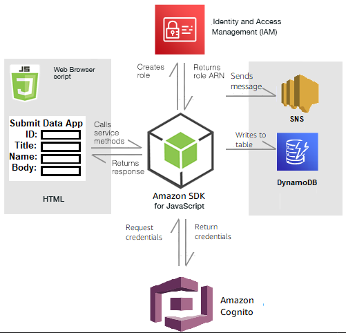

# app-submit-data-to-dynamodb

This repo builds and deploys the resources and code needed for a nodejs application that submits data to dynamodb table (tutorial found here https://docs.aws.amazon.com/sdk-for-javascript/v3/developer-guide/cross-service-example-submitting-data.html)

To create the main.js, use

    ../../node_modules/.bin/webpack  ./add_data.js --mode development --target web --devtool false -o main.js
